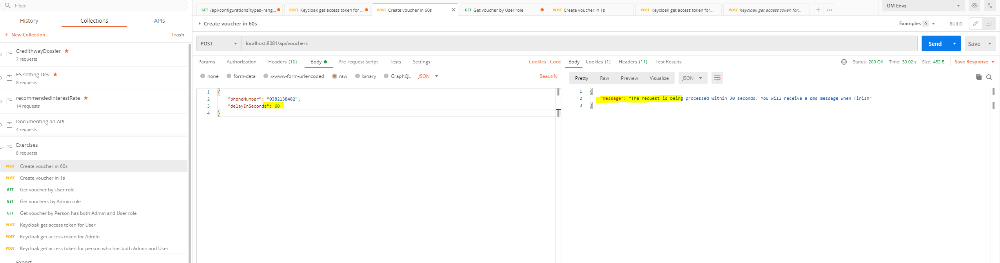
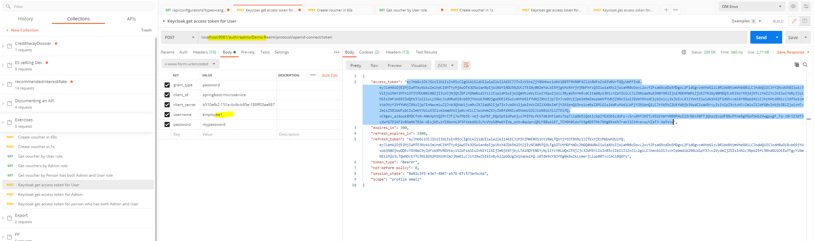

# Voucher

## 1. System requirements
- Docker
- Docker compose
- Java 8 or later
- Free ports: 8081, 8082, 8432, 9081

## 2. Build and run application
### Keycloak and Postgres on docker containers
Ports will be used: 9081 (Keycloak), 8432 (Postgres)

Open new terminal and goto folder vdc_voucher_assignment then run:
`docker-compose up`

#### Information of Keycloak when it's started (Dont do anything in here just for your information)
Keycloak console admin: http://localhost:9081/auth

User pass of admin: admin/admin

Users and roles have been set up: 
- **employee1** with role **user**
- **employee2** with role **admin**
- **employee3** with both roles **user** and **admin**

### Run services in local
Ports will be used: 8081 (voucher-service), 8082 (thirdparties-voucher-service)

Open new terminal and goto folder voucher-service: `cd ./voucher-service`

Run build: `./mvnw clean package`

Run voucher-service service: `java -jar ./target/voucher-service-0.0.1-SNAPSHOT.jar`

Open new terminal and goto folder thirdparties-voucher-service: `cd ./thirdparties-voucher-service`

Run build: `./mvnw clean package`

Run thirdparties-voucher-service service: `java -jar ./target/thirdparties-voucher-service-0.0.1-SNAPSHOT.jar`

## 3. Demo
Import postman collection first to have request samples: open Postman app and import collection: 

### Buy a voucher
Return a voucher code. But when process time is larger than 30s then user will receive a message response that long process. 
And you will be received a SMS text message .

**Limited: SMS text message is not implemented yet**

#### Example:

**Return voucher code when process time is short < 30s.**

**Return a waiting message when process time is longer than 30s.**

Note that if process is running, when you get bought vouchers for this number. Then this buying voucher will not appear in result.
This buying voucher will appear when process running finish. (Use getVouchers request to check when processing and when processed) 

### Get vouchers by phone number
Get access token first
Then use access token to call request to get vouchers by phone number. (Authorization: Bearer <access_token>)

Note: this application designed that only **User** role has permission to get vouchers

If you would like to see access_token information, pass it to https://jwt.io/ and see the result.

#### Example:
User role: can access resource
 
Admin role: will receive a forbidden message
 
Person who has both User and Admin role:
 

## 4. Coverage test result
To see coverage test results, go to **<service_name>/target/site/jacoco/index.html**

